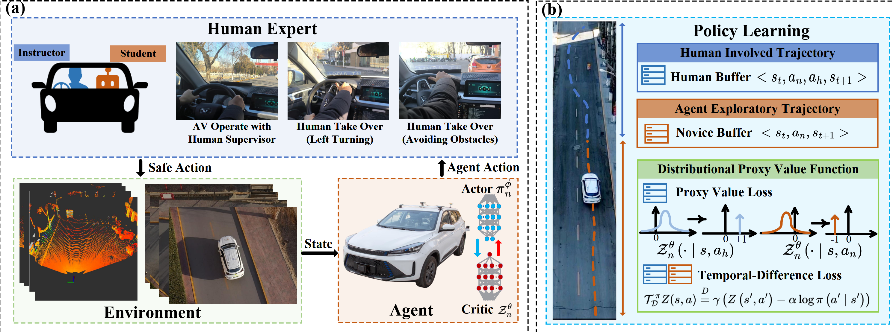
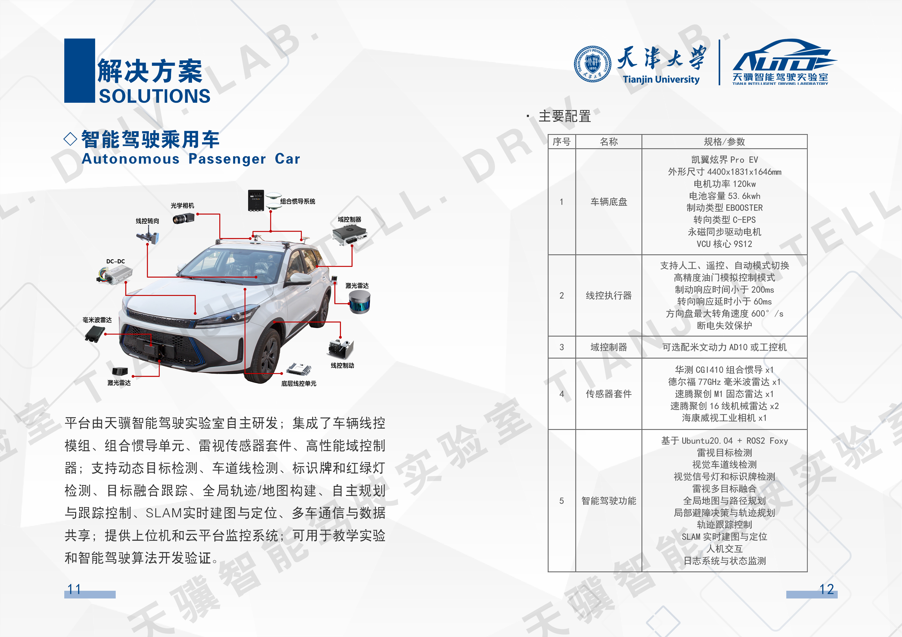

# From Learning to Mastery: Achieving Safe and Efficient Real-World Autonomous Driving with Human-in-the-Loop Reinforcement Learning

This repository contains the official implementation for the paper "From Learning to Mastery: Achieving Safe and Efficient Real-World Autonomous Driving with Human-in-the-Loop Reinforcement Learning" (H-DSAC).

---

### 🎥 Demonstration Video

You can see our method in action in both simulation and the real world by watching our video on Bilibili:

**[H-DSAC: Real-World Autonomous Driving with Human-in-the-Loop RL](https://www.bilibili.com/video/BV1MntGzvE1J/?vd_source=f5570dd1411a8560541af0e815590ae4)**

---

### ✨ Main Innovations



Our work introduces a novel framework for training autonomous driving policies safely and efficiently in real-world environments. The key contributions are:

* **Distributional Proxy Value Function**: We propose a novel value function that encodes human intent through return distributions. This function guides the learning process by assigning higher expected returns to expert-like actions and penalizing actions that require human intervention, ensuring safer and more efficient policy learning.
* **Human-Guided Distributional Soft Actor-Critic (H-DSAC)**: We developed H-DSAC, an algorithm that integrates human feedback directly with off-policy reinforcement learning. This approach significantly enhances sample efficiency, accelerates policy convergence, and improves safety during training by effectively learning from both human demonstrations and autonomous exploration.
* **Real-World Policy Learning**: Our framework enables a vehicle to learn complex driving strategies directly in real-world environments within practical training times. By using robust state representations and the H-DSAC algorithm, we demonstrate an efficient and safe learning process under real-world conditions.

---

### 🚀 User Guide

Follow these steps to set up the environment and run the code.

#### 1. Clone the repository
`cd` to your workspace and clone the repo.
```bash
git clone [https://github.com/lzqw/H-DSAC.git](https://github.com/lzqw/H-DSAC.git)
```
#### 2. Create a new Conda environment
`cd` into the project directory and create the environment.
```bash
conda create -n HDSAC python=3.9
```
#### 3. Activate the virtual environment
```bash
conda activate HDSAC
```
#### 4. Install Pytorch
Select the correct version based on your cuda version and device (cpu/gpu):
```bash
pip3 install torch torchvision torchaudio --index-url https://download.pytorch.org/whl/cu118
```
#### 5. Install other requirements.
```bash
# Install the requirements.
pip install -r requirements.txt
```
#### 6. Training
Modify the sys path in **example_train** file, and run:
```bash
python train_dsact_pvp.py
```


## Real-World Experiment

[cite_start]This section details the source code and procedures for running the H-DSAC algorithm on our real-world Unmanned Ground Vehicle (UGV) platform[cite: 108]. [cite_start]The experiments are conducted on the campus roads of Tianjin University[cite: 234].

### Source Code

The `src` directory contains the program files for the real vehicle experiments. While the complete program directory is shown, we have made the following core modules public:

* [cite_start]**`surrounding_info`**: This module is responsible for acquiring the observation information that serves as input for the reinforcement learning algorithm[cite: 251]. [cite_start]It processes data from sensors like LiDAR to create a vector of distance measurements from nearby vehicles and obstacles[cite: 252].
* [cite_start]**`car_rl`**: This is the main program for executing the H-DSAC algorithm during the training phase[cite: 52, 243].
* [cite_start]**`car_rl_eval`**: This program is used for testing the performance of a saved model after training is complete[cite: 236].

### How to Run

1.  **Prerequisites**: Before launching the learning algorithm, the following essential vehicle nodes must be started. These nodes handle localization, perception, and control.
    * `car_ori`
    * `sonic_obstacle`
    * `regulator`
    * `gps`
    * `imu`
    * `fusion`
    * `lidar_ori`
    * `lidar_obstacle`
    * `camera_ori`
    * `global_path_planning`

2.  **Start Training**: Once the prerequisite nodes are running, you can begin the training process by launching the `surrounding_info` and `car_rl` scripts.

### Vehicle and Contact Information


For further inquiries, please contact:
* [cite_start]**Email**: lizeqiao@tju.edu.cn [cite: 21]
* **Laboratory**: Tianji Intelligent Driving Laboratory